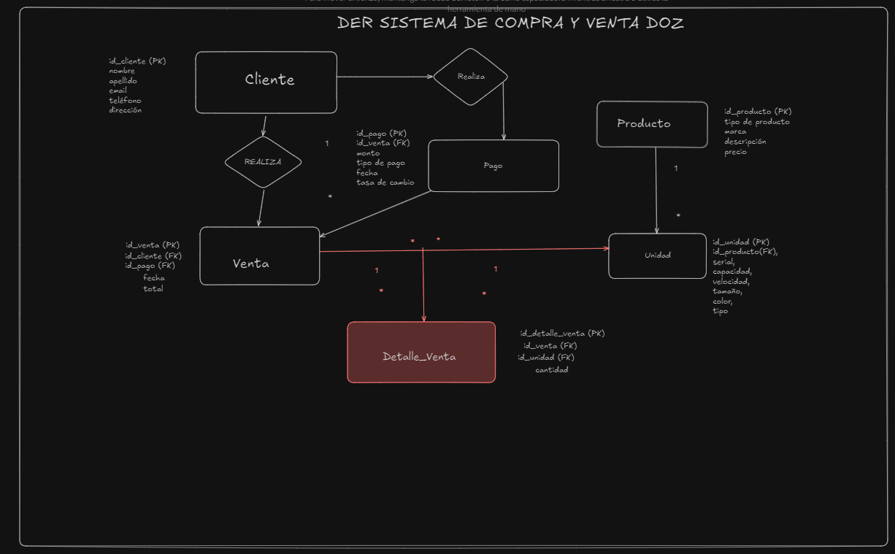

## PRIMER DER de la base de datos dozDB

## DER final de la base de datos dozDB

# Documentación de Base de Datos: `dozDB`

## Tabla: `cliente`
Contiene la información básica de los clientes de la base de datos.

| Campo        | Tipo           | Descripción                            |
|--------------|----------------|----------------------------------------|
| `id_cliente` | INT, PK, AI    | Identificador único del cliente        |
| `nombre`     | VARCHAR(100)   | Nombre del cliente                     |
| `apellido`   | VARCHAR(100)   | Apellido del cliente                   |
| `email`      | VARCHAR(200), UNIQUE | Correo electrónico único         |
| `telefono`   | VARCHAR(100)   | Teléfono de contacto                   |
| `direccion`  | VARCHAR(100)   | Dirección física del cliente           |

---

## Tabla: `venta`
Almacena los datos de las ventas realizadas.

| Campo        | Tipo           | Descripción                            |
|--------------|----------------|----------------------------------------|
| `id_venta`   | INT, PK, AI    | Identificador único de la venta        |
| `id_cliente` | INT, FK        | Referencia al cliente (`cliente`)      |
| `id_pago`    | INT, FK        | Referencia al pago (`pago`) asociado   |
| `fecha`      | DATE           | Fecha de realización de la venta       |
| `total`      | FLOAT(10)      | Monto total de la venta                |

---

## Tabla: `pago`
Registra los pagos realizados en las ventas.

| Campo         | Tipo           | Descripción                            |
|---------------|----------------|----------------------------------------|
| `id_pago`     | INT, PK, AI    | Identificador único del pago           |
| `id_venta`    | INT, FK        | Referencia a la venta (`venta`)        |
| `monto`       | FLOAT(10)      | Monto pagado                           |
| `tipo_pago`   | VARCHAR(200)   | Tipo de pago (efectivo, tarjeta, etc.) |
| `fecha`       | DATE           | Fecha del pago                         |
| `tasa_cambio` | FLOAT(10)      | Tasa de cambio utilizada, si aplica    |

---

## Tabla: `producto`
Define los distintos productos en inventario.

| Campo           | Tipo           | Descripción                            |
|-----------------|----------------|----------------------------------------|
| `id_producto`   | INT, PK, AI    | Identificador único del producto       |
| `tipo_producto` | VARCHAR(200)   | Categoría del producto                 |
| `marca`         | VARCHAR(200)   | Marca del producto                     |
| `descripcion`   | VARCHAR(200)   | Descripción breve del producto         |
| `precio`        | FLOAT(10)      | Precio del producto                    |

---

## Tabla: `unidad`
Representa las unidades individuales de cada producto.

| Campo         | Tipo           | Descripción                            |
|---------------|----------------|----------------------------------------|
| `id_unidad`   | INT, PK, AI    | Identificador único de la unidad       |
| `id_producto` | INT, FK        | Referencia al producto (`producto`)    |
| `sn`          | VARCHAR(200)   | Número de serie                        |
| `capacidad`   | VARCHAR(200)   | Capacidad de la unidad                 |
| `velocidad`   | VARCHAR(200)   | Velocidad, si aplica                   |
| `tamaño`      | VARCHAR(200)   | Tamaño de la unidad                    |
| `color`       | VARCHAR(200)   | Color de la unidad                     |
| `tipo`        | VARCHAR(200)   | Tipo de unidad                         |

---

## Tabla: `detalle_venta`
Almacena los detalles de cada producto vendido en una venta.

| Campo             | Tipo           | Descripción                                   |
|-------------------|----------------|----------------------------------------       |
| `id_detalle_venta`| INT, PK, AI    | Identificador único del detalle de venta      |
| `id_venta`        | INT, FK        | Referencia a la venta (`venta`)               |
| `id_unidad`       | INT, FK        | Referencia a la unidad de producto (`unidad`) |
| `cantidad`        | INT            | Cantidad de unidades vendidas                 |

---

